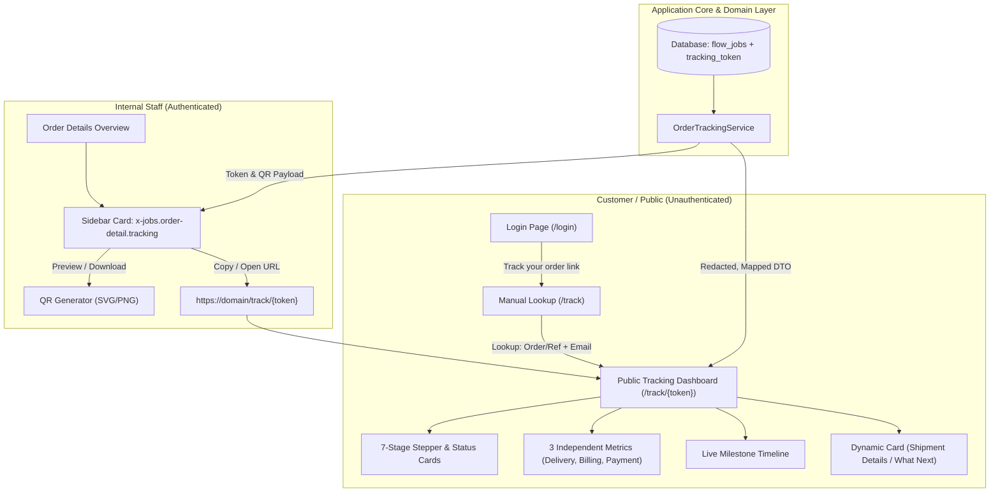

# Order Tracking Implementation Plan (Internal & External)

> **Document Version:** 1.0  
> **Status:** Draft / Ready for Implementation  
> **Author:** Antigravity Engineering  
> **Source References:** Assets and specification files in [`Sample_image/`](../Sample_image)  

---

## 1. Executive Summary

This document specifies the technical design, data architecture, security model, and implementation roadmap for **Internal** and **External Order Tracking** in FlowTrack (Step Promo).

The feature provides two distinct experiences:
1. **Internal Order Tracking (Authenticated Staff):** A dedicated sidebar card on the Order Details screen (`x-jobs.order-detail.tracking`) displaying an instant QR code preview, quick-copy badges for Order Number and Reference Number, direct access to the customer tracking view, QR code downloads, and one-click tracking URL copy.
2. **External Order Tracking (Customer / Public):** A responsive, brand-aligned public tracking portal accessible via direct QR scan (`/track/{token}`) or manual lookup (`/track` using Order/Reference Number + Customer Email). It translates internal workflow states into customer-friendly milestone statuses across a 7-stage horizontal stepper, displays three independent status dimensions (Delivery, Billing, Payment), provides a live event timeline, and offers courier tracking with zero sensitive internal data leakage.

---

## 2. Source Asset Analysis (`Sample_image/`)

The implementation directly reflects the design language and business rules established in [`Sample_image/`](../Sample_image):

| File | Description | Core Implementation Rules Derived |
| :--- | :--- | :--- |
| **`Order-Tracking-Status-Map.xlsx`** (Sheet 1) | **Order Tracking Status Map** | Defines the 27 status mappings across 7 stages with trigger criteria, external status names, customer messages, customer actions, and exception cases (artwork revisions, production holds, QC reworks, partial shipments/payments). |
| **`Order-Tracking-Status-Map.xlsx`** (Sheet 2) | **Tracking Access & Display Rules** | 22 technical requirements covering QR token generation, manual lookup rules, duplicate reference handling, strict customer data redaction, stage progression gates, courier transit rules, and rate limiting. |
| **`Login Page with track order.png`** | **Sign-In Page Entry Point** | Entry point below sign-in form: *"Just checking an order? Track your order →"* with subtext *"Use your order or reference number and email. No sign-in needed."* |
| **`Product Details with QR Code.png`** | **Internal Order Details Sidebar** | Internal sidebar card placed between *Planning & ownership* and *Shipping address* featuring a live QR code, copyable Order & Reference pills, *Open tracking*, *Download QR*, and *Copy tracking link*. |
| **`Order Tracking page.png`** | **External Tracking Page & Lookup** | Split layout: Left manual lookup form (Order/Ref toggle + Email + "Have a QR code?" card); Right comprehensive tracking dashboard (hero banner, 3 independent metrics, 7-stage stepper, live updates timeline, courier shipment card, and bottom banner). |
| **`ChatGPT Images 1–10`** | **Stage Status Variants & Dynamic Cards** | Visual variations for New Order, Artwork (approval alert + CTA), Production (scheduling/hold/completed), QC (in progress/issue/passed), Shipment (dispatched/in transit/delivered/partial), Billing, and Payment. |

---

## 3. High-Level Architecture



---

## 4. Business Logic & State Mapping

### 4.1 The 7 Standard Stages & Color Coding

Each stage in the customer-facing stepper has an assigned color accent and maps to specific internal workflow events:

| Stage # | Stage Name | Accent Color | Primary Internal Event Trigger | External Default Status |
| :---: | :--- | :---: | :--- | :--- |
| **1** | **New Order** | `#2563eb` (Blue) | Order created / PO upload / Handoff | `Order received` / `Order being reviewed` |
| **2** | **Artwork** | `#9333ea` (Purple) | Prepare artwork / Review / Approval | `Artwork in progress` / `Awaiting artwork approval` |
| **3** | **Production** | `#f97316` (Orange) | Delivery estimate / Start production | `Ready for production` / `In production` |
| **4** | **QC** | `#059669` (Green) | Quality check execution / Signoff | `Quality check in progress` / `Quality check passed` |
| **5** | **Shipment** | `#0284c7` (Teal) | Courier booking / Dispatch timestamp | `Dispatched` / `In transit` / `Delivered` |
| **6** | **Billing** | `#db2777` (Pink) | Invoice preparation / Invoice sent | `Preparing invoice` / `Invoice sent` |
| **7** | **Payment** | `#10b981` (Emerald) | Balance due verification / Settlement | `Awaiting payment` / `Paid` / `Order completed` |

### 4.2 Complete 27-State Mapping Matrix (from Excel)

| Stage | Task ID | Internal Task / Event | When to Show | External Status | Customer Message | Customer Action |
| :--- | :---: | :--- | :--- | :--- | :--- | :--- |
| **New Order** | `0` | Order created (system event) | Order saved and identifiers generated | **Order received** | We have received your order. | None |
| **New Order** | `1.1` | Upload Purchase Order | PO upload is pending / being processed | **Order being reviewed** | We are reviewing your order details. | None |
| **New Order** | `1.2` | Send PO to Artwork Team | PO uploaded; handoff pending | **Preparing artwork** | Your order is being sent to our artwork team. | None |
| **Artwork** | `2.1` | Prepare & Upload Artwork | Artwork preparation started | **Artwork in progress** | We are preparing your artwork. | None |
| **Artwork** | `2.2` | Internal Artwork Review | Artwork uploaded; internal review pending | **Artwork under review** | Our team is checking your artwork. | None |
| **Artwork** | `2.3` | Send Artwork to Order Team | Internal review passed; handoff pending | **Artwork under review** | Your artwork is being prepared for approval. | None |
| **Artwork** | `2.4` | Client ERP / Approval | Artwork shared; approval pending | **Awaiting artwork approval** | Please review and approve your artwork. | Approve artwork in authenticated portal |
| **Artwork** | `2.4R` | Client ERP / Approval — revision | Client requests changes; latest not approved | **Artwork revision in progress** | We are updating your artwork based on your feedback. | Review revised artwork when shared |
| **Artwork** | `2.4C` | Client ERP / Approval — approved | Latest version approved; production not started | **Artwork approved** | Your artwork is approved. We are preparing for production. | None |
| **Production** | `3.1` | Set estimated delivery date | Artwork approved; estimate not yet set | **Scheduling production** | We are confirming the production schedule. | None |
| **Production** | `3.2` | Start Production | Estimate set; production not yet started | **Ready for production** | Your order is scheduled for production. | None |
| **Production** | `3.3` | Monitor Production | Production started and not finished | **In production** | Your order is being made. | None |
| **Production** | `3.3H` | Production Issue — blocked | Blocking issue explicitly recorded | **Production on hold** | Production is temporarily on hold. We will share an update. | Only show action when explicitly required |
| **Production** | `3.4` | Finish Production | Production finished; QC not started | **Production completed** | Production is complete. Your order is ready for quality checking. | None |
| **QC** | `4.1` | Perform QC Check | Quality check started; result pending | **Quality check in progress** | We are checking the quality of your order. | None |
| **QC** | `4.1R` | QC Check — failed | QC failed; rework required | **Quality issue being resolved** | We are resolving a quality issue before shipment. | None |
| **QC** | `4.2` | Approve for Shipment | QC passed; shipment approval pending | **Quality check passed** | Your order has passed quality checking. | None |
| **Shipment** | `5.1` | Review shipment details | Approved for shipment; dispatch not recorded | **Preparing shipment** | We are confirming the shipment details. | None |
| **Shipment** | `5.2` | Add courier & tracking number | Shipment details reviewed; courier being added | **Ready for shipment** | Your order is ready to be handed to the courier. | None |
| **Shipment** | `5.3` | Dispatch shipment | Actual handover/dispatch timestamp recorded | **Dispatched** | Your order has been handed to the courier. | Track shipment with courier |
| **Shipment** | `5.T` | Courier transit update | Courier event indicates transit | **In transit** | Your shipment is on its way. | Track shipment |
| **Shipment** | `5.D` | Courier delivery confirmation | Courier delivery confirmed | **Delivered** | Your shipment has been delivered. | Contact support if disputed |
| **Billing** | `6.1` | Prepare Invoice | Shipment complete; invoice not issued | **Preparing invoice** | We are preparing your invoice. | None |
| **Billing** | `6.2` | Send Invoice | Invoice prepared but not successfully sent | **Invoice ready** | Your invoice is ready and will be sent to you. | None |
| **Billing** | `6.2C` | Send Invoice — sent | Successful invoice send timestamp recorded | **Invoice sent** | Your invoice has been sent to your registered email. | Check email / sign in to view invoice |
| **Payment** | `7.1` | Await payment | Invoice sent; balance due > 0 | **Awaiting payment** | Payment is pending for your order. | Sign in to view payment instructions |
| **Payment** | `7.2` | Verify payment | Payment submitted; verification pending | **Payment under review** | We are checking your payment. | None |
| **Payment** | `7.3` | Confirm payment | Verified payment covers invoice balance | **Paid** | Your payment has been confirmed. | None |
| **Payment** | `7.P` | Partial payment | Verified payment received; balance remains | **Partially paid** | A payment has been received. A balance remains. | Sign in to view remaining balance |

### 4.3 Three Independent Milestone Metrics (Rule #12)

The tracking header continuously displays three separate status dimensions that progress independently:
1. **Delivery:** `Awaiting update` → `With courier` → `Dispatched` → `In transit` → `Delivered` *(or `Partially dispatched` / `Partially delivered`)*.
2. **Billing:** `Upcoming` → `Preparing invoice` → `Invoice ready` → `Invoice sent`.
3. **Payment:** `Upcoming` → `Awaiting payment` → `Payment under review` → `Partially paid` → `Paid`.

> [!IMPORTANT]
> A billing status advance (e.g. *Preparing invoice*) must never overwrite or replace *Dispatched* in the Delivery summary. Both dimensions remain visible simultaneously.

---

## 5. Security & Data Protection Rules

As mandated in the specification sheet:
1. **Opaque Tokenization:** Tokens are non-sequential, cryptographically secure 32-character strings (e.g. `Str::random(32)`). No IDs, dates, or client identifiers are encoded.
2. **Strict Redaction:** The external view **never** renders:
   - Staff/owner names, email addresses, or avatars.
   - Internal task comments, notes, or operational blocker descriptions.
   - Supplier names, factory locations, or purchase costs.
   - Client street address or phone number (protecting privacy if the tracking link is forwarded).
   - Internal raw attachments or documents.
3. **Lookup Rate Limiting & Anti-Enumeration:**
   - Manual lookup (`/track/lookup`) is throttled to 10 requests per minute per IP.
   - Invalid lookups always return the exact generic message:
     *"We could not find a matching order. Check your number and email address."*  
     (Never indicate whether an order exists or if the email was the only mismatched field).
4. **Duplicate Reference Disambiguation:**
   - If a customer reference matches multiple orders for the same verified email, render a minimal order selection card displaying `Order Number` and `Order Date` rather than guessing or picking the first record.

---

## 6. Technical Implementation Details

### 6.1 Database Migration
Create `database/migrations/xxxx_xx_xx_add_tracking_token_to_flow_jobs_table.php`:
```php
use Illuminate\Database\Migrations\Migration;
use Illuminate\Database\Schema\Blueprint;
use Illuminate\Support\Facades\Schema;

return new class extends Migration {
    public function up(): void
    {
        Schema::table('flow_jobs', function (Blueprint $table) {
            $table->string('tracking_token', 64)->nullable()->unique()->after('order_number');
            $table->timestamp('tracking_token_created_at')->nullable()->after('tracking_token');
            $table->index(['job_number', 'tracking_token']);
        });
    }

    public function down(): void
    {
        Schema::table('flow_jobs', function (Blueprint $table) {
            $table->dropIndex(['job_number', 'tracking_token']);
            $table->dropColumn(['tracking_token', 'tracking_token_created_at']);
        });
    }
};
```

### 6.2 Token Lifecycle in `FlowJob` Model
In `app/Models/FlowJob.php`:
```php
protected static function booted(): void
{
    static::creating(function (FlowJob $job) {
        if (empty($job->tracking_token)) {
            $job->tracking_token = \Illuminate\Support\Str::random(32);
            $job->tracking_token_created_at = now();
        }
    });
}

public function getTrackingUrlAttribute(): string
{
    return route('order.track.show', ['token' => $this->tracking_token]);
}
```

### 6.3 Domain Service: `App\Services\OrderTrackingService`
This service evaluates an order's internal aggregate and produces a sanitized data transfer object (`TrackingViewData`):
```php
namespace App\Services;

use App\Models\FlowJob;

class OrderTrackingService
{
    public function getCustomerTrackingData(FlowJob $job): array
    {
        return [
            'order_number' => $job->job_number ?: $job->order_number,
            'reference_number' => $job->reference_number ?: $job->job_number,
            'last_updated' => $job->updated_at->format('M d, Y, h:i A'),
            'is_sample' => (bool) ($job->category === 'Sampling' || str_contains(strtolower($job->title), 'sample')),
            'current_stage' => $this->resolveCurrentStage($job),
            'hero_status' => $this->resolveHeroStatus($job),
            'metrics' => [
                'delivery' => $this->resolveDeliveryMetric($job),
                'billing' => $this->resolveBillingMetric($job),
                'payment' => $this->resolvePaymentMetric($job),
            ],
            'stages' => $this->buildSevenStageStepper($job),
            'timeline' => $this->buildPublicTimeline($job),
            'shipment' => $this->resolveShipmentDetails($job),
            'next_step' => $this->resolveNextStepCard($job),
            'banner' => $this->resolveBannerNotice($job),
        ];
    }
}
```

### 6.4 QR Code Generator
Provide a lightweight endpoint `GET /orders/{order}/qr-code` that returns pure SVG or high-resolution PNG using standard inline vector generation without external cloud dependencies.

### 6.5 Route Definitions
In `routes/web.php`:
```php
// Public Order Tracking
Route::prefix('track')->middleware(['web'])->group(function () {
    Route::get('/', [OrderTrackingController::class, 'index'])->name('order.track');
    Route::post('/lookup', [OrderTrackingController::class, 'lookup'])
        ->name('order.track.lookup')
        ->middleware('throttle:10,1');
    Route::get('/{token}', [OrderTrackingController::class, 'show'])->name('order.track.show');
});

// Authenticated Staff QR Code generator
Route::middleware(['auth'])->group(function () {
    Route::get('/orders/{order}/qr-code', [OrderQrCodeController::class, 'show'])->name('orders.qr');
});
```

---

## 7. UI Components & Screen Mockup Parity

### 7.1 Internal Sidebar Card (`x-jobs.order-detail.tracking`)
- **Placement:** In `resources/views/components/jobs/detail-overview.blade.php` directly after `<x-jobs.order-detail.planning>` and before `<x-jobs.order-detail.shipping>`.
- **Elements:**
  - Card Header: `Order tracking` with navigation icon `>`.
  - QR Code Box: High-contrast centered QR code preview.
  - Heading: **Scan to track this order**.
  - Information Rows:
    - Order number pill with copy-to-clipboard button.
    - Reference number pill with copy-to-clipboard button.
  - Subtext: *"Opens the customer tracking view."*
  - Buttons:
    - `[ Open tracking ]` (Teal primary button, opens `/track/{token}` in new tab).
    - `[ Download QR ]` (Secondary outlined button, downloads `order-{number}-qr.png`).
  - Action link: `🔗 Copy tracking link` with visual copied notification.

### 7.2 Login Screen Link
- **Placement:** In `resources/views/auth/login.blade.php` beneath the form submit button.
- **Visuals:** Thin divider, *"Just checking an order?"*, box icon with arrow: `Track your order →`, subtitle *"Use your order or reference number and email. No sign-in needed."*

### 7.3 Public Tracking Portal (`resources/views/tracking/`)
- **Search Panel (Left):**
  - Segmented tab control: `[ Order number ]` / `[ Reference number ]`.
  - Input field for the active identifier type.
  - Input field for customer email.
  - Teal action button: `Track order`.
  - Information helper card: *"Have a QR code? Scan the QR code on your order confirmation to open tracking directly."*
- **Dashboard Panel (Right):**
  - **Header:** Order number + optional `Sample order` pill + Reference & last updated timestamp.
  - **Hero Status Banner:** Light teal/status background, icon, status badge, and descriptive copy.
  - **Top-right Metrics Cards:** Delivery, Billing, Payment status pills.
  - **7-Stage Horizontal Stepper:** 7 cards with stage numbers, names, status chips (`Completed ✓`, `Current · In progress`, `Upcoming`), and bottom border accents.
  - **Live Updates Timeline (Bottom-Left):** Step-by-step progress nodes with timestamps and safe milestone labels.
  - **Shipment / Next Steps (Bottom-Right):**
    - If dispatched: Courier name, tracking number, and `Track shipment ↗` button.
    - If awaiting artwork approval: Urgent yellow banner with `Sign in to review artwork` action.
    - If in production/QC: Informational next step guidance card.
  - **Bottom Banner:** Phase explanation banner (e.g. *"Billing in progress: We are preparing your invoice. No action is needed right now."*).
  - **Footer Link:** `↺ Track another order`.

---

## 8. Rollout & Verification Checklist

- [ ] **Step 1: Database & Migration**
  - [ ] Run migration adding `tracking_token` and `tracking_token_created_at` to `flow_jobs`.
  - [ ] Execute backfill command generating tokens for existing orders.
- [ ] **Step 2: Service Layer & State Machine**
  - [ ] Implement `OrderTrackingService` with 27 status mappings and redaction filters.
  - [ ] Add unit test suite verifying each stage transition, hold status, and customer action.
- [ ] **Step 3: Internal Order Details Card**
  - [ ] Create `resources/views/components/jobs/order-detail/tracking.blade.php`.
  - [ ] Integrate into `resources/views/components/jobs/detail-overview.blade.php`.
  - [ ] Verify QR code display, clipboard copy actions, and download functionality.
- [ ] **Step 4: Public Tracking & Authentication Entry**
  - [ ] Update `resources/views/auth/login.blade.php` with tracking link.
  - [ ] Implement `OrderTrackingController` (lookup, rate limiting, and token view).
  - [ ] Build `resources/views/tracking/show.blade.php` and matching stylesheet `resources/css/tracking.css`.
- [ ] **Step 5: Visual Parity & Quality Gates**
  - [ ] Compare desktop and mobile viewport rendering against all 14 files in `Sample_image/`.
  - [ ] Confirm no internal employee names, costs, internal notes, or raw IDs are present in HTML.
  - [ ] Execute Pint code formatting and automated feature test suite.
